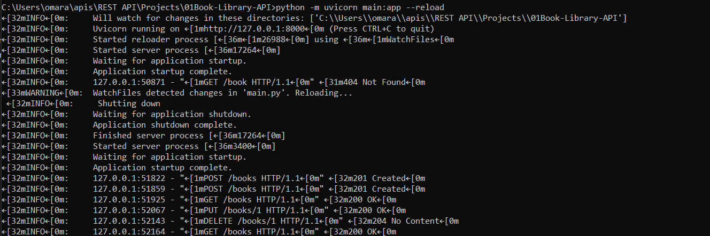
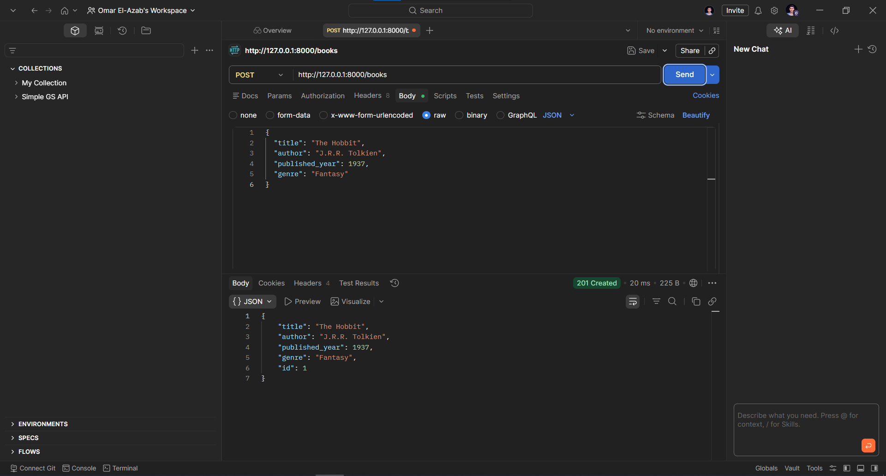
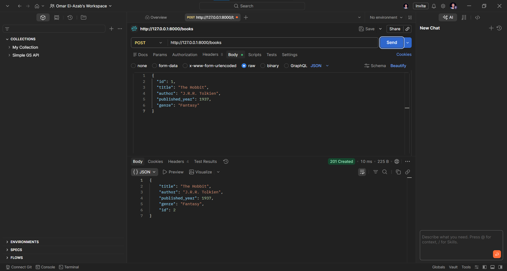
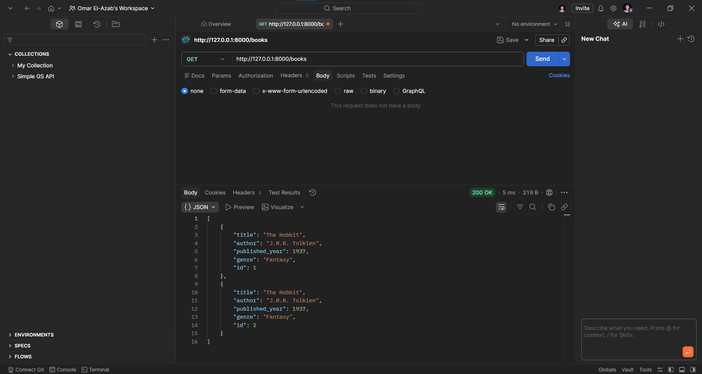
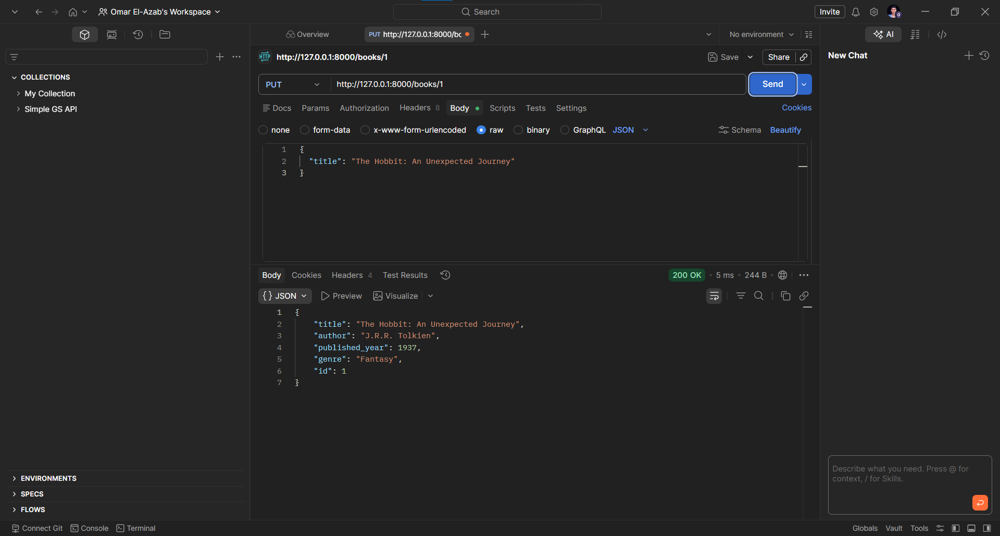
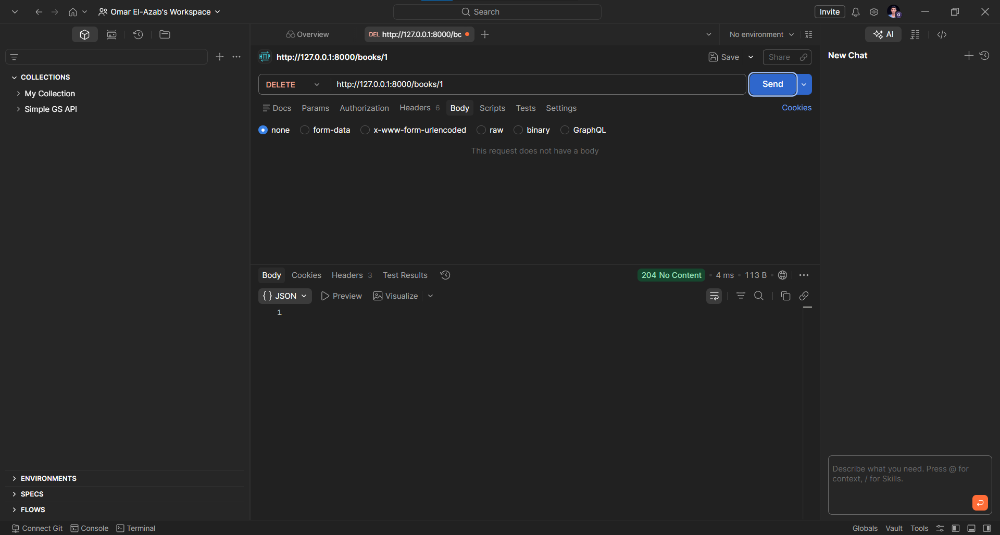
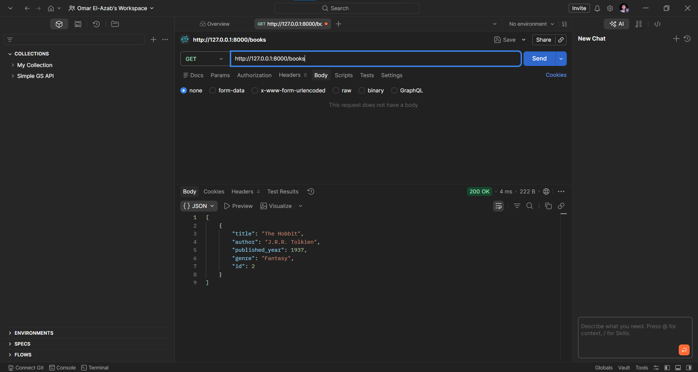

# Book Library API

**Book Library API** built with FastAPI. It supports simple CRUD operations, automatic documentation, and in‑memory data storage (easily replaceable with a database).

## Project Structure

```
01Book-Library-API/
├── main.py
├── models.py
└── requirements.txt
```

## 1. Install Dependencies
run:

```bash
pip install -r requirements.txt
```


## 2. Run the API

```bash
uvicorn main:app --reload
```
or
```bash
python -m uvicorn main:app --reload
```

Your API will be available at `http://127.0.0.1:8000`


## 3. Explore Interactive Documentation

- **Swagger UI**: [http://127.0.0.1:8000/docs](http://127.0.0.1:8000/docs)  
- **ReDoc**: [http://127.0.0.1:8000/redoc](http://127.0.0.1:8000/redoc)

## Example Requests & Responses

### Create a book (POST `/books`)
```json
{
  "title": "The Hobbit",
  "author": "J.R.R. Tolkien",
  "published_year": 1937,
  "genre": "Fantasy"
}
```
**Response** (201 Created):
```json
{
  "id": 1,
  "title": "The Hobbit",
  "author": "J.R.R. Tolkien",
  "published_year": 1937,
  "genre": "Fantasy"
}
```

### Get all books (GET `/books`)
```json
[
  {
    "id": 1,
    "title": "The Hobbit",
    "author": "J.R.R. Tolkien",
    "published_year": 1937,
    "genre": "Fantasy"
  }
]
```

### Update a book (PUT `/books/1`)
```json
{
  "title": "The Hobbit: An Unexpected Journey"
}
```
Response returns the updated book.

### Delete a book (DELETE `/books/1`) → 204 No Content

## Output 

---

---

---

---

---

---
